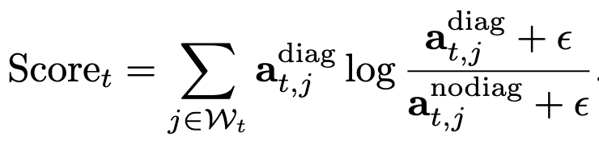
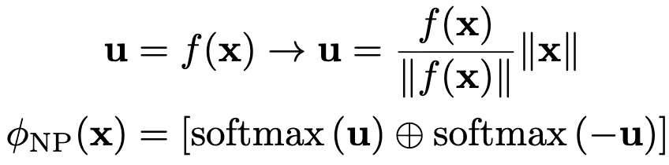
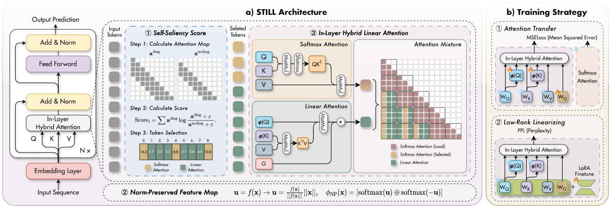

<div align="center">

<h1>STILL: Selecting Tokens for Intra-Layer Hybrid Attention to Linearize LLMs</h1>


<p>
  <strong>🚀 This repository contains the official code for <strong>STILL</strong>.</strong><br>
  <strong>⭐ If you like our work, please support us with a star</strong>
</p>


<p>
  <a href="https://arxiv.org/abs/2602.02180"></a>
  <a href="https://arxiv.org/pdf/2602.02180"></a>
  
  <a href="https://github.com/ZacharyMeng/STILL/stargazers"></a>
</p>

</div>

## 🔥 News
- [2026.09]   🔥 **STILL** has been accepted to NeurIPS 2026, and the complete paper will be released soon!


## Introduction

### Motivation

Large Language Models (LLMs) suffer from quadratic computational complexity ($\mathcal{O}(N^2)$) in standard Softmax Attention, which limits scalability to long sequences. Existing intra-layer hybrid attention methods for LLM linearization face two critical challenges:

1. **Position-based token routing:** Sliding-window-based token selection fails to capture token-specific global importance, discarding crucial non-local tokens from high-fidelity Softmax Attention (SA).
2. **Norm distortion in Linear Attention:** Learnable feature maps in Linear Attention (LA) distort pretrained feature magnitudes, breaking the *norm-aware* property of pretrained LLMs and degrading performance.

To address these limitations, we propose **STILL**, an intra-layer hybrid linearization framework that achieves linear complexity while preserving the expressive power of pretrained LLMs.

---

## Method

STILL introduces three core innovations to enable efficient and effective LLM linearization.

### 1. Self-Saliency Score for Content-Aware Token Selection

We design a **Self-Saliency Score** with strong local–global consistency to estimate token importance using only sliding-window computation. This score quantifies how much a token relies on its self-attention term, enabling reliable selection of salient tokens for SA (high-fidelity modeling) while routing the rest to LA (efficient summarization) — replacing heuristic position-based routing.

Formally, the Self-Saliency Score is computed by comparing sliding-window attention distributions with and without the diagonal (self-attention) term:

<p align="center">
  
</p>

where $\mathcal{W}_t$ is the local window index set, $\mathbf{a}^{\mathrm{diag}}$ and $\mathbf{a}^{\mathrm{nodiag}}$ are attention distributions with and without the self-attention term, and $\epsilon$ is a small constant for numerical stability.

### 2. Norm-Preserved Feature Map (NP-Map)

To preserve pretrained norm statistics, we propose **NP-Map**, which decouples feature direction from magnitude and reinjects pretrained norms into Linear Attention feature maps:

<p align="center">
  
</p>

where $f(\cdot)$ is the learnable MLP in the feature map. NP-Map ensures Linear Attention aligns with the pretrained model's representational intensity while satisfying non-negativity constraints.

### 3. Unified Training–Inference Architecture

We adopt **chunk-wise parallelization** and **delayed selection** to improve hardware efficiency:

- **Delayed selection:** Token routing is performed at chunk granularity instead of per token during decoding, reducing overhead and improving parallelism.
- **Chunk-wise parallel form:** Sequences are split into chunks for parallel computation of saliency scores and hybrid attention, unifying training and inference logic while maintaining linear complexity.

<p align="center">
  
  <br>
  <sub><b>Overview of STILL.</b> Salient tokens are retained for high-fidelity Softmax Attention, while the remaining context is summarized by Linear Attention.</sub>
</p>

---

## Results

STILL achieves state-of-the-art performance on standard reasoning and long-context benchmarks while delivering significant efficiency gains.

<p align="center">
  
  
  
</p>

### Key Performance Highlights

- **Reasoning Tasks:** Matches or surpasses the original pretrained LLM on commonsense and general reasoning tasks (PIQA, ARC, HellaSwag, WinoGrande), with up to **10.5% gains on MMLU** over prior linearized baselines.
- **Long-Context Tasks:** Recovers **86.2% of full-attention performance** on long-context benchmarks (RULER, BABILong) — a regime where existing hybrid baselines largely fail.
- **Efficiency:** Cuts required training tokens from **1000+B to 0.04B**, achieves **45% average memory reduction**, and delivers **28% decoding speed-up** for sequences beyond 8K tokens.

---

<a id="environment"></a>

## ⚙️ Environment

Prepare the Python environment and install the dependencies:

```bash
# Create and activate the environment
conda create -n still python=3.10 -y
conda activate still

# Install project dependencies
pip install -r requirements.txt
pip install flash-attn --no-build-isolation
```

---

<a id="training"></a>

## 📚 Training

Linearizing a pretrained model involves four steps:

1. **Prepare the base model**

   Place the model weights (for example, Llama-3.1-8B) under `./checkpoints/` and rename the directory to `still_llama31_8B_base`.

2. **Modify the model configuration**

   Edit `./checkpoints/still_llama31_8B_base/config.json` and update:

   ```json
   {
     "architectures": ["StillModelForCausalLM"],
     "model_type": "still"
   }
   ```

3. **Adjust the training configurations**

   Set `model.pretrained_model_name_or_path` and other training options in:

   - `configs/still_at_step1.yaml` for Stage 1
   - `configs/still_ar_step2.yaml` for Stage 2

4. **Launch training**

   ```bash
   # Stage 1: Attention Transfer
   CUDA_VISIBLE_DEVICES=0 python run.py --cfg configs/still_at_step1.yaml

   # Stage 2: Low-Rank Linearization
   CUDA_VISIBLE_DEVICES=0 python run.py --cfg configs/still_ar_step2.yaml
   ```

---

## Acknowledgements

This code is developed on top of [LoLCATs](https://github.com/HazyResearch/lolcats) and [Liger](https://github.com/OpenSparseLLMs/Linearization).

## Citation

If you find this repository helpful, please consider citing our work:

```latex
@inproceedings{meng2026still,
  title={STILL: Selecting Tokens for Intra-Layer Hybrid Attention to Linearize LLMs},
  author={Weikang Meng and Liangyu Huo and Yadan Luo and Jiawen Guan and Jingyi Zhang and Yingjian Li and Zheng Zhang},
  booktitle={Advances in Neural Information Processing Systems (NeurIPS)},
  year={2026}
}
```
